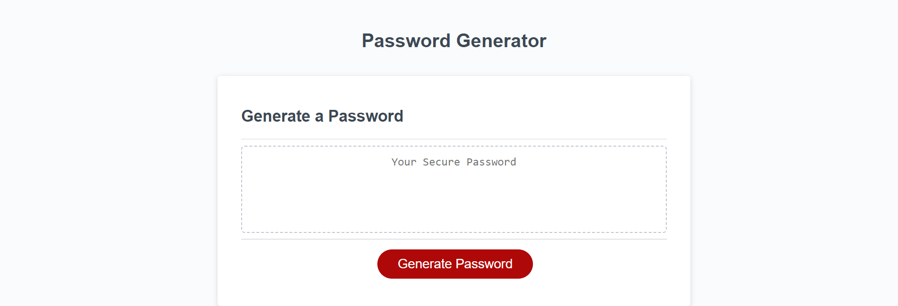

# Password Generator JS

A simple password generator that prompts you with a series of messasge box alerts in the browser to determine the criteria in which you would like your password to be created with. The password generator can be used here on GitHub Pages: https://mforte215.github.io/password-generator-js/

## Table of Contents (Optional)

- [Installation](#installation)
- [Usage](#usage)
- [Credits](#credits)
- [License](#license)

## Installation

N/A

## Usage

The purpose of this website is to help the user create a new password. When the red 'generate password' button is clicked on the screen, the user will be prompted with as series of message boxes to determine the criteria of the password. This criteria includes the length of the password along with the what character sets you wish to include into the password. Once the message boxes are completed, the new password will appear in the center of the page in the text box.

A screenshot of the current site:

Link to the website deployed on GitHub Pages: https://mforte215.github.io/password-generator-js/

Link to the code repository on GitHub: https://github.com/mforte215/password-generator-js

## Credits

N/A

## License

Please refer to the LICENSE in the repo
